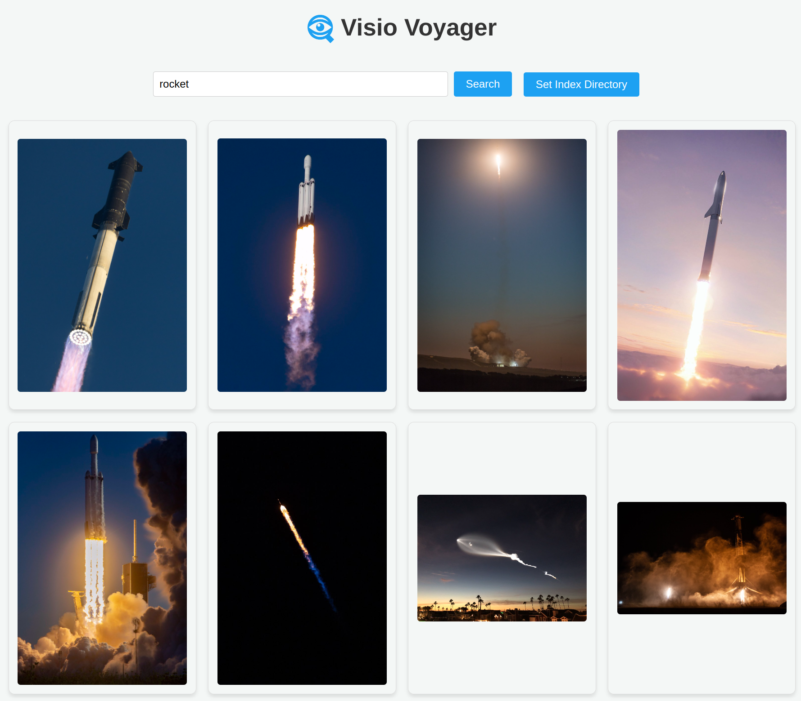

#  Visio Voyager

Visio Voyager is a simple web-based image search and viewing tool. It allows users to search for images within a specified folder using natural language and view them through a web interface.



### Dependencies

```shell
pip install -r requirements.txt
```

### Running the Application

1. Start the application by running: `python main.py`

2. The web application will be accessible at `http://127.0.0.1:6841`.

3. Specify a folder you want to index using the `Set Index Directory` button. This will recursively index all images in the folder and its subfolders. If you want to add more folders just hit the index button again and select additional folders. If you want to clear the index just delete the `embeddings.db` file in the root directory of this project.

4. Search for images you want using the text box and hit enter or the `Search` button.

5. You can hover on the resulting images to view their filepaths.
